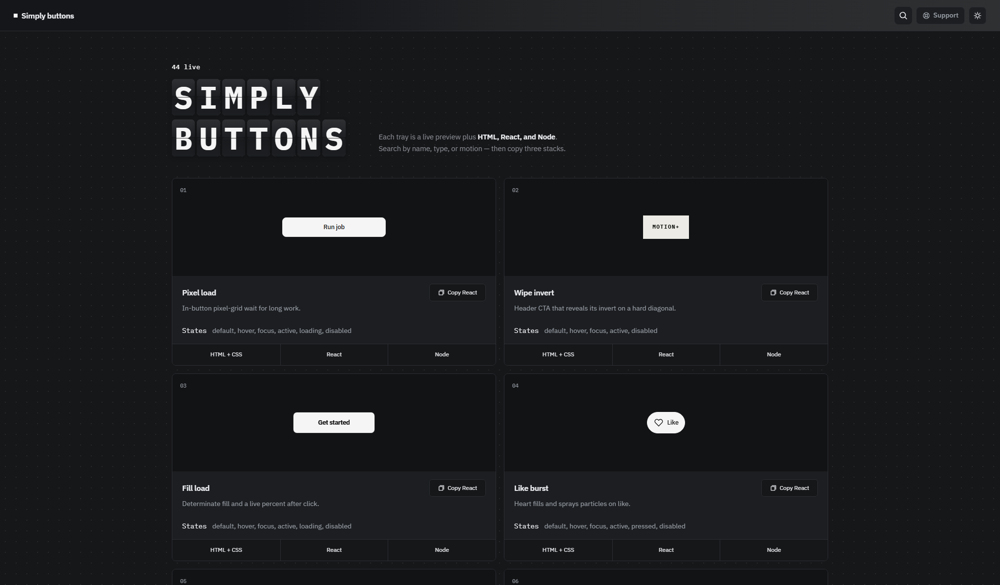

# Simply Buttons

A focused gallery of interactive button ideas. Every card is a live preview with copyable HTML + CSS, React, and Node implementations.



## Run locally

```bash
npm install
npm run dev
```

Open the local URL shown by Vite. Use the search control to find a button, then copy the implementation from its card.

## Build

```bash
npm run build
```
